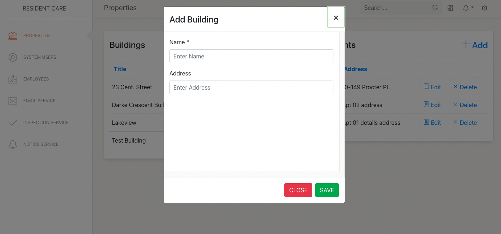
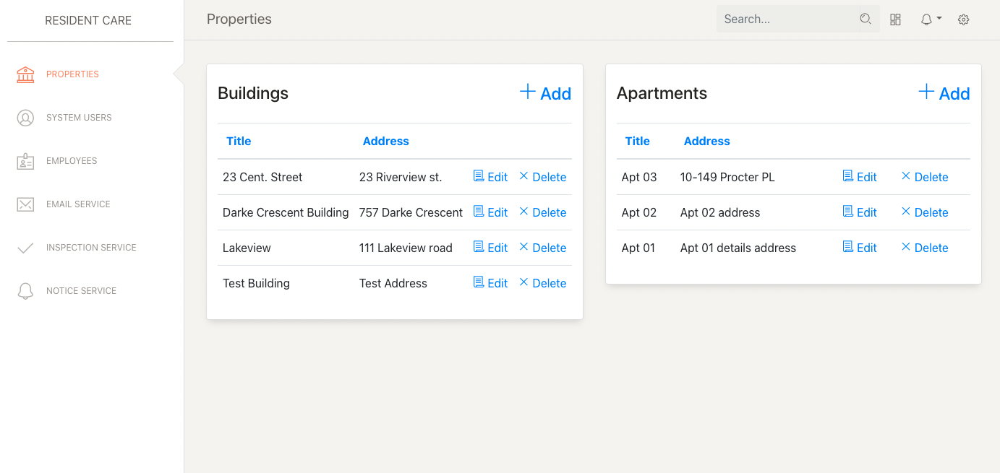
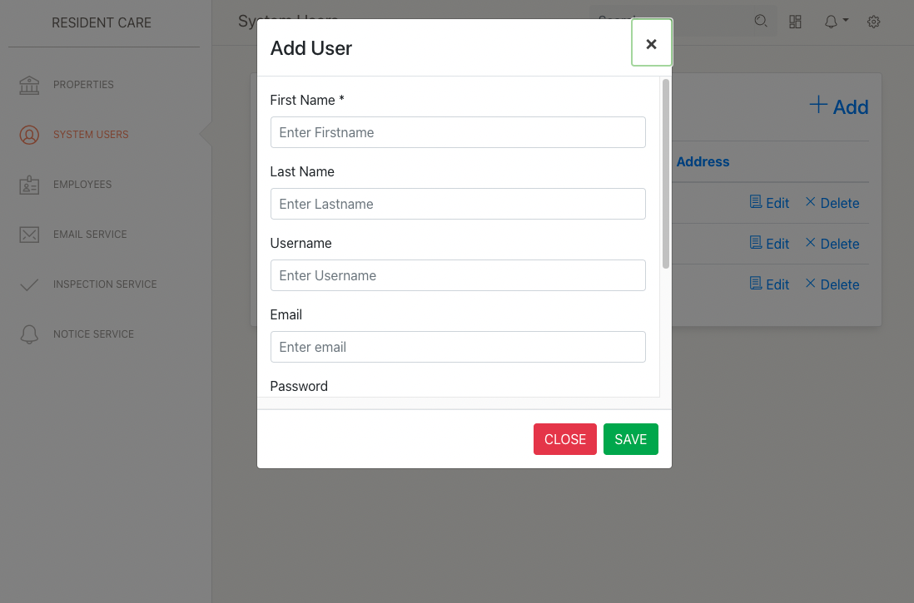
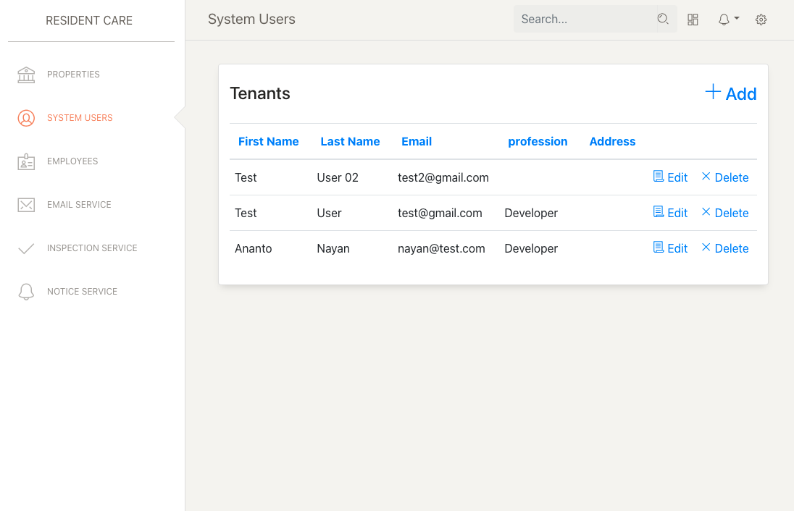
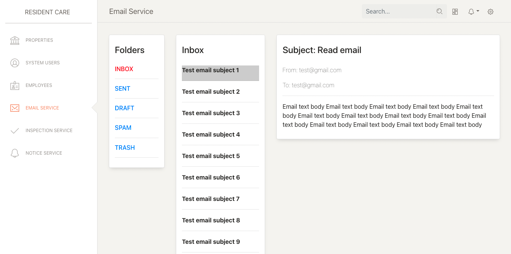

## Resident-Care:

### Languages and Tools:

* Java
* Sprint Boot
* Kafka
* JavaScript
* TypeScript
* Angular

### Config:

```Python
version: '3'

services:
  zookeeper:
    image: zookeeper
    container_name: zookeeper
    ports:
      - '2181:2181'

  kafka:
    image: kafka
    container_name: kafka
    ports:
      - '9092:9092'
    environment:
      KAFKA_ADVERTISED_HOST_NAME: localhost
      KAFKA_ZOOKEEPER_CONNECT: zookeeper:2181
```

### Preview:







